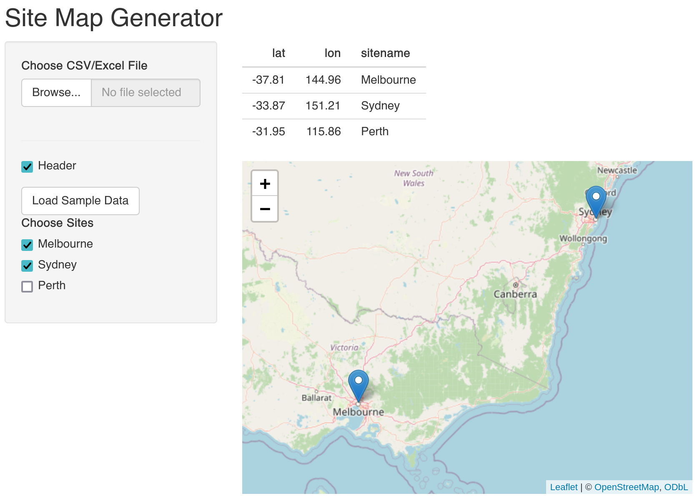
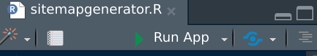

# Quick Guide: Creating a Site Map Generator with Shiny in R
{: .fs-9 .no_toc }

New release
{: .label .label-purple }

Chris Keneally - PhD Candidate, Freshwater & Ecophysiology, School of Biological Sciences, The University of Adelaide, South Australia
{: .fs-6 .fw-300 }

[christopher.keneally@adelaide.edu.au](mailto:christopher.keneally@adelaide.edu.au)

------------------------------------------------------------------------

<details closed markdown="block">
  <summary>
    Table of contents
  </summary>
  {: .text-delta }
- TOC
{:toc}
</details>

------------------------------------------------------------------------

# Introduction

[Shiny](https://www.rstudio.com/products/shiny/) apps in R are a fantastic way to build interactive web applications directly from your R code. They're great for visualizing data, running analyses, or just exploring stuff visually. 


*The quick and dirty map app in question.*

For this quick runthrough, I've built a basic app (above) which takes geospatial data and visualises it with leaflet - handy for when you need a quick peek or even to grab a screenshot for more detailed mapping later. The app is currently live (please let me know if not) and available to try out below:

[Sitemap Generator Shiny App](https://cckeneally.shinyapps.io/sitemapgenerator/){: .btn .btn-green}

To visualise your own data, format your coordinates into columns as you see displayed in the Sample data: `lat`, `lon`, and `sitename`, save as a .csv/.xlsx file, and upload! To learn how to build the app, read on.

## Prep

First of all, open a new R script in RStudio (or a new 'Shiny Web App' is also an option if you want to start off with an example app to run and look at immediately). You can paste the code blocks below into your script, and this will become your local app - when saved you will see a "run app" prompt appear within rstudio, like this:



# Building the Shiny app

## Libraries to load

```
library(shiny)
library(readr)
library(readxl)
library(leaflet)
```

These are the tools to make the app work - `shiny` for the app magic, `readr` and `readxl` for data handling (including .csv, .tsv, and excel files), and `leaflet` for the simple map visuals.

## Sample data

```
sample_data <- data.frame(
  lat = c(-37.8136, -33.8688, -31.9505),
  lon = c(144.9631, 151.2093, 115.8605),
  sitename = c("Melbourne", "Sydney", "Perth")
)
```

Some basic example locations to get started and help users understand the required input data - Melbourne, Sydney & Perth.

## Building the app UI

```
ui <- fluidPage(
  titlePanel("Site Map Generator"),
  sidebarLayout(
    sidebarPanel(
      fileInput("file1", "Choose CSV/Excel File",
                accept = c(
                  "text/csv",
                  "text/comma-separated-values,text/plain",
                  ".csv",
                  "text/tab-separated-values",
                  ".tsv",
                  ".xlsx"
                )
      ),
      tags$hr(),
      checkboxInput("header", "Header", TRUE),
      actionButton("loadSample", "Load Sample Data"),
      uiOutput("siteSelection") # Dynamic UI for site selection
    ),
    mainPanel(
      tableOutput("contents"),
      leafletOutput("map")
    )
  )
)
```

The `ui` (User Interface) is where you lay out all the elements that the user will see & interact with. In Shiny, this is done using a hierarchy of layout functions and UI elements. Here's a breakdown of each component in my example:

-   `fluidPage`: a function that creates a page with a fluid layout in Shiny. It allows the elements within it to adjust dynamically to the size of the browser window. This is particularly useful for making applications that are responsive to different screen sizes.

-   `titlePanel`: Creates a panel at the top of the page to display a title. It’s a simple way to add a main heading.

-   `sidebarLayout`: divides your UI into two main sections: a sidebarPanel and a mainPanel. It's a common layout in Shiny apps, providing a neat way to organize inputs (in the `sidebarPanel`) and outputs (in the `mainPanel`).

-   `fileInput`: Allows users to upload CSV or Excel files. The accept parameter specifies the types of files that can be uploaded.

-   `tags$hr`: A horizontal line to visually break up the UI elements.

-   `checkboxInput` & `uiOutput`: Creates a checkbox that users can toggle to include header rows, and a group of checkboxes to dynamically select from sites.

-   `actionButton`: Creates a clickable button.

-   `tableOutput` & `leafletOutput`: Display data table and an interactive leaflet-based map in the `mainPanel`.

## Defining server logic

```
server <- function(input, output) {
  # Reactive value to store the uploaded data
  uploadedData <- reactiveVal(NULL)
  
  # Reactive value to store the sample data
  sampleData <- reactiveVal(sample_data)
  
  # Load user data when a file is uploaded
  observeEvent(input$file1, {
    req(input$file1)
    ext <- tools::file_ext(input$file1$name)
    
    uploadedData(switch(ext,
                        csv = read_csv(input$file1$datapath, col_names = input$header),
                        tsv = read_tsv(input$file1$datapath, col_names = input$header),
                        xlsx = read_excel(input$file1$datapath),
                        stop("Invalid file format")
    ))
  })
  
  # Load sample data when the button is clicked
  observeEvent(input$loadSample, {
    uploadedData(sampleData())
  })
  
  # Update site selection UI based on the uploaded data
  output$siteSelection <- renderUI({
    if (is.null(uploadedData())) return(NULL)
    checkboxGroupInput("selectedSites", "Choose Sites", choices = unique(uploadedData()$sitename))
  })
  
  # Render the table
  output$contents <- renderTable({
    if (is.null(uploadedData())) return()
    uploadedData()
  })
  
  # Render the map
  output$map <- renderLeaflet({
    if (is.null(uploadedData())) return()
    
    # Filter data based on selected sites
    map_data <- uploadedData()
    if (!is.null(input$selectedSites)) {
      map_data <- map_data[map_data$sitename %in% input$selectedSites, ]
    }
    
    leaflet(map_data) %>% 
      addTiles() %>% 
      addMarkers(lng = ~lon, lat = ~lat, popup = ~sitename)
  })
}
```

Here's where the action happens. The server function reacts to user inputs, manages data, and updates the UI and map accordingly.

-    `uploadedData <- reactiveVal(NULL)`: Initializes a reactive value to store data uploaded by the user. Initially set to `NULL`.

-     `sampleData <- reactiveVal(sample_data)`: Initializes a reactive value for storing the predefined sample data.

-   `observeEvent(input$file1, {...})`: Watches for a file upload event. When a file is uploaded, `req(input$file1)` Ensures that a file is actually uploaded, `ext <- tools::file_ext(input$file1$name)`: Extracts the file extension of the uploaded file, `uploadedData(switch(ext, ...))`: Reads the uploaded file based on its extension (csv, tsv, xlsx) and updates the `uploadedData` reactive value. If the file format is invalid, it stops the operation.

-     `observeEvent(input$loadSample, {...})`: Listens for a click on the "Load Sample Data" button and loads the sample data into `uploadedData`.

-     `output$siteSelection <- renderUI({...})`: Dynamically creates a checkbox group for site selection. The choices are updated based on the unique site names in the uploaded data.

-     `output$contents <- renderTable({...})`: Renders a table in the UI to display the data stored in `uploadedData`. It shows nothing if `uploadedData` is `NULL`.

-   `output$map <- renderLeaflet({...})`: Creates and displays a Leaflet map in the UI, filters `uploadedData` based on selected sites if any are chosen, adds tiles to the map for background, and places markers on the map at the locations specified in the filtered data, with popups showing the site names.

Each of these components is crucial for the server-side functionality of the Shiny app, enabling it to respond dynamically to user inputs and to render the appropriate UI elements.

## Running the app

```
shinyApp(ui, server)
```

The last line to add to the script - this allows shiny to call the defined UI and server logic to run the map and load some maps.

# Conclusion

So, overall this app:
-   Loads basic user geospatial data in various formats (and provides example sampledata).
-   Allows choice of sites.
-   Rapidly visualises data in a table and on a leaflet map.

It's complexity could be increased further to provide options for overlying environmental data as colours - or whatever else you can imagine!
